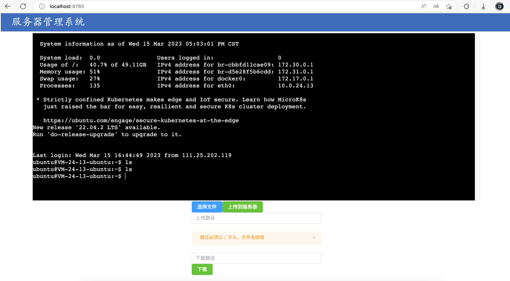

_# web-ssh

## 介绍
极简的ssh，仅有ssh与文件上传下载

## 运行
1. 配置 application.yml的ssh信息，项目运行端口
2. 运行vue3，npm run build，
3. 将生成的dist目录下的文件，放入/resources/static下
4. 运行springboot

## 技术栈
springboot3，vue3，element-plus，jsch，websocket

## 示例图片

